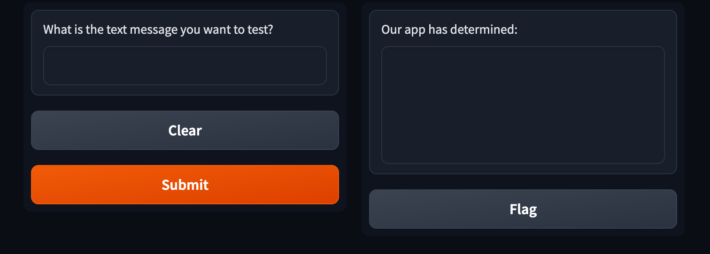

# sms_spam_detector

## The Goal
I'll be refactoring code from an SMS text classification jupyter notebook into a function that constructs a linear Support Vector Classification (SVC) model. Once the model is created and trained, I will create a Gradio app to host the application, enabling users to test text messages. The application will provide feedback to users, indicating whether the text is classified as spam or not, based on the model's performance.

## Challenge Instructions
The starter files consist of the following files: 
    gradio_sms_text_classification.ipynb, 
    sms_text_classification_solution.ipynb, and 
    SMSSpamCollection.csv.

### Create the SMS Classification Function
Using the code in the sms_text_classification_solution.ipynb file, create the sms_classification function in the gradio_sms_text_classification.ipynb by doing the following:

Set the features variable to the text message column of the DataFrame.

Set the target variable to the "label" column of the DataFrame.

Split data into training and testing and set the test_size to 33%.

Build a pipeline to transform the test set to compare to the training set.

Fit the model to the transformed training data and return model.

Load the SMSSpamCollection.csv into a DataFrame and call the sms_classification function with the DataFrame, and set the result to the "text_clf" variable.

### Create the SMS Prediction Function
Use the sms_prediction function to predict the classification of a new text by doing the following:

Create a variable that will hold the prediction of a new text.

Use a conditional statement that determines if the text message is "ham" or “spam”.

If the message is “ham”, the function should return the following message: f'The text message: "{text}", is not spam.'

If the message is spam, the function should return the following message: f'The text message: "{text}", is spam.'

### Create the Gradio Interface Application
Create a Gradio Interface application that takes a textbox for the inputs and has a textbox for the output. The textboxes should have labels that describe what each textbox contains.

Launch the application and provide the URL to share the application. Your application should look like the following:

Use the following text messages to test your application.

1. You are a lucky winner of $5000!
2. You won 2 free tickets to the Super Bowl.
3. You won 2 free tickets to the Super Bowl. Text us to claim your prize.
4. Thanks for registering. Text 4343 to receive free updates on medicare.

Requirements
Create the SMS Classification Function (50 points)
The features variable is set equal to the text message column of the DataFrame. (8 points)

The target variable is set equal to the "label" column of the DataFrame. (8 points)

The data is split into training and testing sets, and the test_size is set to 33%. (8 points)

A Pipeline is built using the TfidfVectorizer and LinearSVC to transform the test set and compare it to the training set. (8 points)

The model is fitted to the transformed training data and the model is returned. (8 points)

The SMSSpamCollection.csv is read into a DataFrame. (5 points)

The DataFrame is passed to the sms_classification function and the result is set equal to the "text_clf" variable. (5 points)

Create the SMS Prediction Function (30 points)
A variable that holds the prediction of a new text is created. (8 points)

A conditional statement that determines if the text message is "ham" or “spam” is created. (12 points)

The conditional returns a message if the text is “ham”. (5 points)

The conditional returns a message if the text is “spam”. (5 points)

Create the Gradio Interface Application (20 points)
A Gradio Interface application is created with three parameters for the “function”, “outputs”, and “inputs”. (6 points)

The “outputs” parameter is a textbox that contains a label to let the user know what to type in the box. (4 points)

The “inputs” parameter is a textbox that contains a label to let the user know that the prediction will be displayed in the textbox. (4 points)

The Interface application can be shared with other users with a public URL. (2 points)

The Gradio Interface works as expected and there are no errors after a user submits a text message. (4 points)